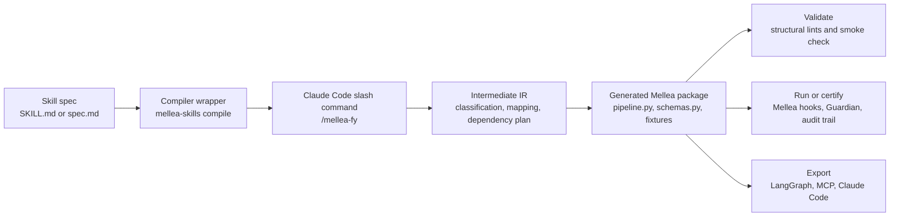

# Mellea Skills Compiler documentation

Mellea Skills Compiler turns natural-language agent skill specifications into typed, runnable Mellea packages, then adds validation, governance, audit, certification, and export tooling around those packages. The docs in this folder explain the codebase from the perspective of a user trying to run it and a developer trying to extend it.

---

## Start here

| Document | Use it for |
|---|---|
| [Mellea demystified](mellea-demystified.md) | The 360-degree explanation: what Mellea is, why this project calls itself a skill compiler, what pain points it addresses, where it works well, and where it needs improvement. |
| [User onboarding](user-onboarding.md) | The shortest path from checkout to productive use, including setup, first run, compile, run, certify, and export. |
| [Architecture and control flow](architecture-and-control-flow.md) | How the package is organized and how control moves through CLI commands, compiler stages, runtime execution, certification, and export. |
| [Compiler pipeline](compiler-pipeline.md) | The actual compile path: Claude Code slash commands, intermediate IR, deterministic writers, lints, smoke checks, and generated package anatomy. |
| [Runtime governance and certification](runtime-governance-and-certification.md) | How AI Atlas Nexus, Granite Guardian, Mellea hooks, audit trails, compliance classification, and reports fit together. |
| [Extension guide](extension-guide.md) | How to add skills, dialects, compiler checks, deterministic writers, export targets, policy controls, and tests. |
| [Codebase map](codebase-map.md) | File-by-file map of the implementation surface and the most important examples and tests. |

## Mental model

The key idea is simple: a Markdown skill is easy to write but hard to govern. This project compiles that Markdown into a structured Python program whose inputs, outputs, model calls, fixtures, runtime settings, and governance evidence can be inspected.

