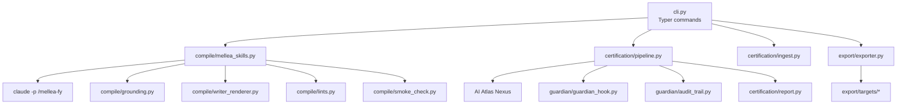
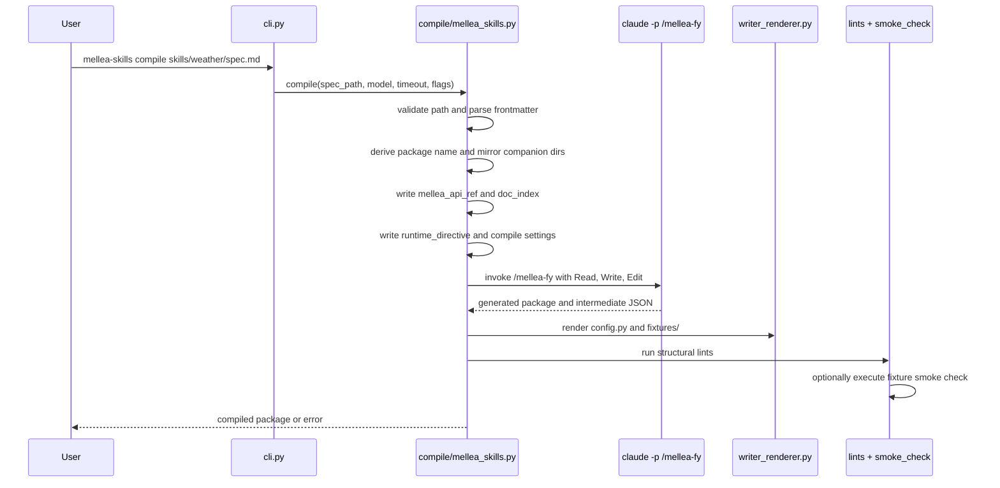

# Architecture and control flow

The codebase has four major runtime surfaces: compile, run/certify, export, and generated examples.



## Package structure

| Path | Responsibility |
|---|---|
| `src/mellea_skills_compiler/cli.py` | Typer command definitions. It is the only installed console entry point: `mellea-skills`. |
| `src/mellea_skills_compiler/compile/` | Compile wrapper, grounding generation, Claude proxy, lints, smoke check, and deterministic writer renderer. |
| `.claude/commands/` | The Claude Code slash-command specifications for the LLM-assisted compiler workflow. |
| `.claude/schemas/` | JSON Schema contracts for intermediate compiler artifacts. |
| `.claude/melleafy/writers/` | Deterministic Python writers for `config.py` and `fixtures/`. |
| `src/mellea_skills_compiler/certification/` | Static ingest, risk manifest generation, runtime certification pipeline, compliance classification, reports. |
| `src/mellea_skills_compiler/guardian/` | Mellea plugins for Guardian risk checks and JSONL audit trail. |
| `src/mellea_skills_compiler/export/` | Export pipeline and target translators. |
| `src/mellea_skills_compiler/toolkit/` | Shared parsing, dynamic import, fixture loading, and logging utilities. |
| `examples/` | Precompiled reference skills and their generated packages. |
| `skills/` | Source skill specs and source assets. |
| `tests/` | Unit tests for parser/loading, lints, smoke checks, compliance, Guardian audit trail, and policy manifest data models. |

## CLI dispatch

`pyproject.toml` registers:

```toml
[project.scripts]
mellea-skills = "mellea_skills_compiler.cli:app"
```

`cli.py` maps user commands to implementation modules:

| CLI command | Implementation call |
|---|---|
| `compile` | `compile.mellea_skills.compile(...)` |
| `validate` | `compile.mellea_skills.validate(...)` |
| `run` | `certification.pipeline.skill_pipeline(...)` |
| `ingest` | `certification.ingest.ingest_one(...)` |
| `certify` | `certification.pipeline.full_pipeline(...)` |
| `export` | `export.exporter.run_export(...)` |

## Compile control flow

`mellea-skills compile <spec>` is a wrapper around Claude Code plus deterministic post-processing.



Key design point: the LLM does not own every file. `config.py` and `fixtures/` are rendered from IR by deterministic writers. Claude Code is denied direct Write/Edit access to those paths through a per-invocation settings file from `compile/claude_directives.py`.

## Runtime `run` control flow

`mellea-skills run <pkg> --fixture <id>` loads and executes a compiled package.

1. `certification/pipeline.py:skill_pipeline(...)` validates the package path.
2. `toolkit/file_utils.py:load_skill_pipeline(...)` imports `<package>.pipeline` and finds the locally defined `run_*` function.
3. `toolkit/file_utils.py:load_fixtures(...)` imports `fixtures/` and reads either `ALL_FIXTURES` factory functions or `FIXTURES` dicts.
4. If Guardian is enabled and an `audit/policy_manifest.json` exists, `guardian/register_plugins(...)` registers Guardian and audit plugins.
5. `_run_single_fixture(...)` calls the pipeline with fixture context.
6. Plugins are deregistered in `finally`.

## Certification control flow

```mermaid
flowchart LR
    A["Load compiled package"] --> B["Load fixture"]
    B --> C["Parse SKILL.md"]
    C --> D["Classify sensitivity"]
    D --> E["Generate use case"]
    E --> F["AI Atlas Nexus risk/action identification"]
    F --> G["policy_manifest.json and POLICY.md"]
    G --> H["Register Guardian and Audit plugins"]
    H --> I["Run fixture through pipeline"]
    I --> J["runtime_audit.jsonl and pipeline_report.json"]
    J --> K["Classify governance requirements"]
    K --> L["CERTIFICATION.md"]
```

`mellea-skills certify <pkg>` performs static policy generation plus runtime evidence capture.



The certification pipeline has two evidence sources:

| Evidence | Produced by | Used by |
|---|---|---|
| Static risk/action manifest | `certification/nexus_policy.py` | Policy document, Guardian config, compliance summary |
| Runtime audit trail | `guardian/audit_trail.py` | Certification report evidence extractors |

## Export control flow

`mellea-skills export <pkg> --target mcp` wraps a compiled package for another harness.

`export/exporter.py` runs five stages:

| Stage | Function | Behavior |
|---|---|---|
| 1. Validate | `stage1_validate` | Locate and parse `melleafy.json`, check target and manifest version. |
| 2. Load | `stage2_load` | Parse `entry_signature`, resolve importable package dir, detect policy manifest. |
| 3. Translate | `stage3_translate` | Dispatch to `targets/langgraph.py`, `targets/claude_code.py`, or `targets/mcp.py`. |
| 4. Emit | `stage4_emit` | Copy bundled package, supporting assets, adapter files, reverse manifest, notes. |
| 5. Lint | `stage5_lint` | Check target-specific structural requirements. |

The exporter treats the compiled package as the stable core. It does not recompile or reinterpret the source spec.

## Dynamic loading contract

The runtime loader is intentionally simple:

| Contract | Implementation |
|---|---|
| Pipeline entry point | Any callable in `pipeline.py` whose name starts with `run_`, preferring functions defined in that module. |
| Fixture contract | `fixtures/__init__.py` exports `ALL_FIXTURES` or `FIXTURES`. |
| `ALL_FIXTURES` shape | List of factory functions returning `(inputs, fixture_id, description)`. |
| Dict fixture shape | List of dicts with `id` and `context`. |

This gives generated packages a stable, inspectable shape while preserving enough flexibility for different skill modalities.

## Important architectural boundaries

| Boundary | Why it matters |
|---|---|
| Spec source vs compiled package | Source skill files remain the input. Generated package files can be regenerated. |
| LLM-generated code vs writer-rendered code | Deterministic writers prevent drift in load-bearing files. |
| Static governance vs runtime governance | `ingest` can generate policy without execution; `certify` proves runtime hook behavior with audit entries. |
| Mellea hooks vs deterministic Python tool calls | Mellea hooks observe Mellea generation and tool events. Plain Python helper calls need code-level safeguards. |
| Export adapter vs compiled core | Target adapters wrap `run_pipeline(...)`; they do not replace the Mellea package's internal semantics. |

