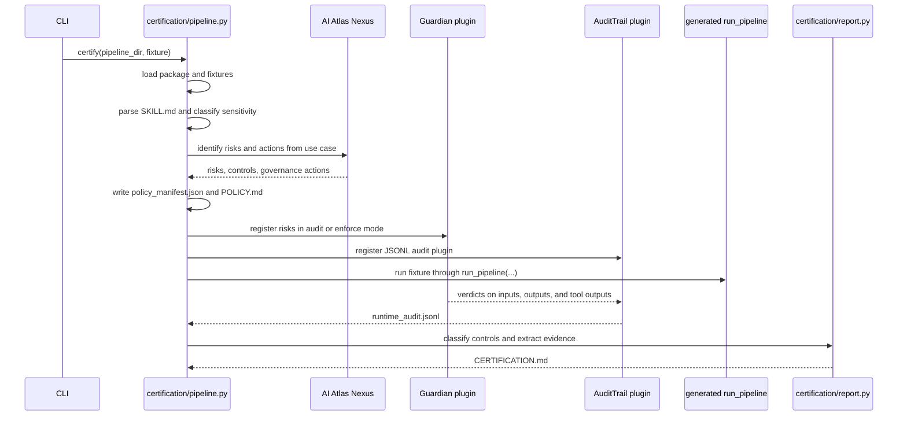

# Runtime governance and certification

Certification connects a skill's intended use, its generated runtime behavior, and its governance evidence.

The core flow is implemented in `src/mellea_skills_compiler/certification/pipeline.py`.

## Two governance modes

| Command | Scope | Runtime execution |
|---|---|---|
| `mellea-skills ingest <spec.md>` | Static risk and policy generation from a raw spec. | No compiled pipeline run. |
| `mellea-skills certify <compiled_pkg>` | Full policy generation, Guardian hook registration, fixture execution, audit trail, compliance classification, report generation. | Yes. |

Use `ingest` to preview risk policy before compile or when runtime dependencies are unavailable. Use `certify` when you need evidence from an actual pipeline run.

## End-to-end certification flow



## Risk identification

`certification/nexus_policy.py:generate_policy_manifest(...)` calls AI Atlas Nexus:

```python
nexus.identify_risks_and_actions_from_usecases(
    [use_case],
    risk_inference_engine,
    taxonomy=governance_taxonomies,
    zero_shot_only=True,
)
```

The result is normalized into:

| Dataclass | File | Meaning |
|---|---|---|
| `NexusRisk` | `models.py` | A risk with name, description, Guardian prompt, taxonomy, and native/custom flag. |
| `GovernanceAction` | `models.py` | A taxonomy action or control linked to the identified risks. |
| `PolicyManifest` | `models.py` | The complete policy object written to `policy_manifest.json`. |

Guardian risks are split into two kinds:

| Kind | How it is represented | Runtime effect |
|---|---|---|
| Native | Nexus risk has a Guardian taxonomy tag. | Guardian receives the calibrated tag such as `harm` or `jailbreak`. |
| Custom | No native Guardian tag exists. | Guardian receives the risk description as custom criteria. |

## Policy artifacts

Certification writes policy files to the skill root's `audit/` directory.

| Artifact | Produced by | Meaning |
|---|---|---|
| `policy_manifest.json` | `PolicyManifest.to_json(...)` | Machine-readable risks, taxonomies, governance actions, model used. |
| `POLICY.md` | `generate_policy_markdown(...)` | Human-readable runtime checks and governance requirements. |
| `runtime_audit.jsonl` | `AuditTrailPlugin` | One JSON event per observed hook event. |
| `pipeline_report.json` | `full_pipeline(...)` | Serialized output of the fixture run. |
| `CERTIFICATION.md` | `generate_certification_report(...)` | Coverage summary and evidence extracted from audit events. |

## Guardian plugin behavior

Guardian runtime checks are implemented in `guardian/guardian_hook.py`.

| Plugin | Mode | Behavior |
|---|---|---|
| `GuardianAuditPlugin` | `PluginMode.AUDIT` | Checks input and output risks but never blocks execution. |
| `GuardianEnforcePlugin` | `PluginMode.SEQUENTIAL` | Blocks input, output, or tool output when a risk is flagged. |

`GuardianAuditPlugin.from_manifest(...)` chooses the plugin class based on the `enforce` flag and loads risk prompts from the `PolicyManifest`.

The plugin registers hooks for:

| Hook | Purpose |
|---|---|
| `GENERATION_PRE_CALL` | Assess the input prompt before generation. |
| `GENERATION_POST_CALL` | Assess the model output after generation. |
| `TOOL_PRE_INVOKE` | Log LLM-directed tool calls before execution. |
| `TOOL_POST_INVOKE` | Assess tool output after execution. |

## Audit trail behavior

`guardian/audit_trail.py` writes append-only JSONL entries. It runs at priority 100 so Guardian verdicts from priority 40 are available in payload metadata.

Audit entries include:

| Event type | Captured fields |
|---|---|
| `generation_pre_call` | Session id, request id, action preview, model options. |
| `generation_post_call` | Output preview, latency, Guardian verdicts, risk flag. |
| `component_pre_execute` | Component type and session id. |
| `component_post_success` | Component type and latency. |
| `component_post_error` | Component type and error. |
| `validation_post_check` | Validation pass/fail and reason. |
| `tool_pre_invoke` | Tool name and args preview. |
| `tool_post_invoke` | Tool output preview, success/error, latency, Guardian verdicts. |

The audit plugin's `summary()` method is used by the certification pipeline to print event counts.

## Compliance classification

`certification/classification.py` classifies governance actions as `AUTOMATED`, `PARTIAL`, or `MANUAL`.

The current implementation is conservative and mapping-driven:

1. For each `GovernanceAction`, inspect `categorized_as`.
2. Resolve each category id through AI Atlas Nexus.
3. If the broader top group is named `Implemented`, classify it as `AUTOMATED`.
4. Otherwise default to `MANUAL`.

The returned `ComplianceSummary` exposes `.automated`, `.partial`, `.manual`, and `.counts`.

## Certification report evidence

`certification/report.py` extracts evidence from audit entries.

| Evidence extractor | Uses |
|---|---|
| `_extract_guardian_evidence` | Count generation events, Guardian checks, risk categories, and flagged incidents. |
| `_extract_audit_evidence` | Count audit events, hook coverage, timestamps, and policy id tagging. |
| `_extract_io_evidence` | Confirm generation inputs and outputs were captured. |
| `_extract_incident_evidence` | Summarize flagged generations. |
| `_extract_performance_evidence` | Summarize latency when present. |

Evidence is mapped to pipeline control ids through `EVIDENCE_EXTRACTORS`.

## What works well

| Strength | Why it matters |
|---|---|
| Runtime evidence is real | Certification can include actual hook events, not only static claims. |
| Risk prompts are policy-driven | Guardian checks are loaded from `policy_manifest.json`, not hard-coded per skill. |
| Audit and enforce modes share logic | Users can start in observe-only mode and move to blocking mode. |
| Reports are generated from structured data | Policy manifests, audit trails, and compliance summaries can be inspected independently. |

## Current limits

| Limit | Practical impact |
|---|---|
| Compliance mapping is shallow | A control may be classified automatically based on category mapping, not full semantic proof. |
| Guardian model availability is external | Certification quality depends on `OLLAMA_API_URL` and model availability. |
| Pattern 2 deterministic tool calls may bypass Mellea tool hooks | Plain Python helpers need code-level governance because Mellea hook events may not see them. |
| `ingest` has no runtime evidence | Static certification reports explicitly lack audit events. |
| Report text includes fixed known-limitations language | Some limitations may become stale as hooks evolve. |

## Good extension targets

1. Add richer `RiskControlGroup` mappings and tests for `classify_governance_requirements`.
2. Add fixture-level expected Guardian verdicts so certification can assert risk behavior.
3. Add model-unavailable and Guardian-failed sections to `CERTIFICATION.md`.
4. Separate static policy report from runtime certification report so the evidence difference is impossible to miss.
5. Add policy manifest versioning and schema validation.
6. Add credential, filesystem, network, memory, and scheduling controls beyond generation checks.

